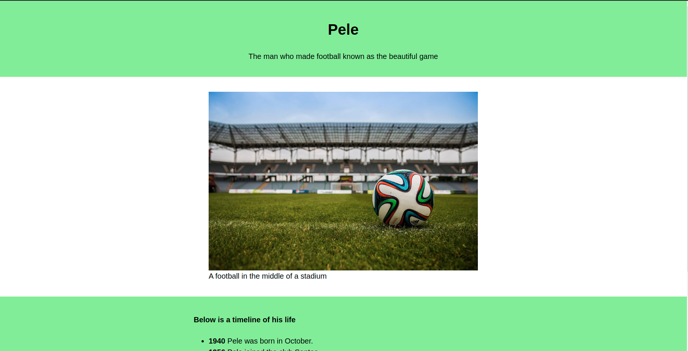

# tribute-collabo

> This is a practice project about one of football's greatest players ever, Pele. The key focus is the PR review

## Built With

- HTML5 & CSS3
- No frameworks

## Live Demo

[Live Demo Link](https://kabohajeanmark-nytimes-clone.onrender.com/)

## Getting Started

To get a local copy up and running follow these simple example steps.

### Setup
- Download this GitHub Repo and go the index.html file

### Install
- Set up liveserver as an extension in your VS Code

### Usage
- Right click and open the index.html in your browser to view

## Authors

👤 **Author1**

- GitHub: [@KabohaJeanMark](https://github.com/KabohaJeanMark)
- Twitter: [@jean_quintus](https://twitter.com/jean_quintus)
- LinkedIn: [LinkedIn](https://www.linkedin.com/in/jean-mark-kaboha-software-engineer/)

## 🤝 Contributing

Contributions, issues, and feature requests are welcome!

Feel free to check the [issues page](issues/).

## Show your support

Give a ⭐️ if you like this project!

## Acknowledgments

- Hat tip to Microverse for the README template, instructions and tutoring
- Inspired by Free Code Camp.s Responsive Web Design Certification

## Inspirations
- The life of Pele

## 📝 License

This project is [MIT](./LICENSE) licensed.